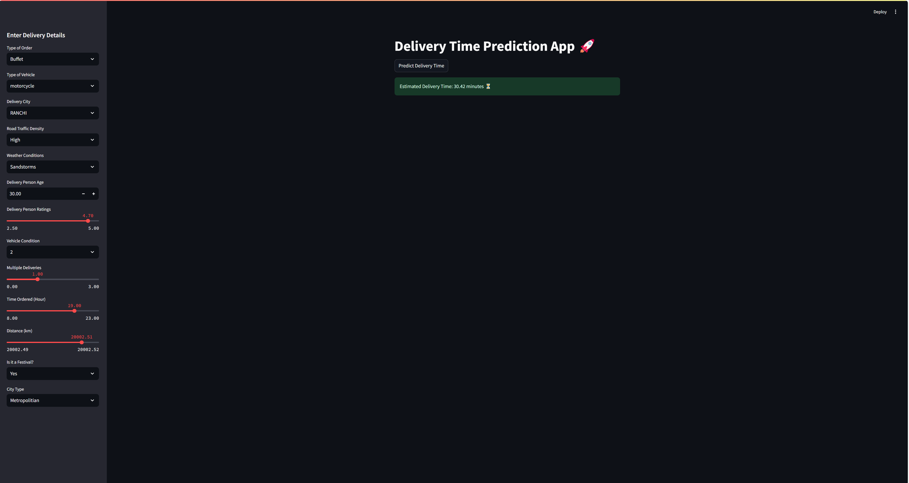

# 📦 Moduler Project – Delivery Time Prediction App

This project is a **modular machine learning pipeline** designed to predict delivery times based on historical data. It follows a clean, production-ready architecture with custom modules for each pipeline step and is wrapped in an interactive **Streamlit app** for ease of use.

---

## 🚀 Key Features

- 🔄 **Modular architecture** for scalability and reusability
- 📥 **Data ingestion** from raw sources
- 🧹 **Data transformation** with preprocessing and cleaning
- 🎯 **Model training** with customizable pipelines
- 📈 **Batch prediction** using saved models
- 🌐 **Streamlit app** for real-time delivery time prediction
- 📦 Ready for deployment with `setup.py` and `requirements.txt`

---

## 🗂️ Project Structure

```bash
moduler-project/
│
├── Artifacts/               # Stores trained model artifacts
├── Data/                    # Raw and processed datasets
├── batch_prediction/        # Code for batch prediction
├── config/                  # Configuration files (e.g., params)
├── src/                     # Core source code
│   ├── Components/          # Modular components for the ML pipeline
│   │   ├── data_ingestion.py        # Handles data ingestion
│   │   ├── data_transformation.py   # Manages data transformation
│   │   └── model_trainer.py         # Responsible for model training
│   │
│   ├── Config/              # Configuration-related modules
│   ├── Constants/           # Constant values used across the project
│   ├── Entity/              # Entity definitions and data classes
│   ├── Exception/           # Custom exception handling
│   ├── Logger/              # Logging setup and utilities
│   ├── Pipeline/            # Pipeline orchestration modules
│   └── Utils/               # Utility functions and helpers
│
├── app.py                   # Streamlit app entry point
├── main.py                  # Orchestrates the ML pipeline
├── requirements.txt         # Python dependencies
├── setup.py                 # For packaging the project
├── schema.yml               # Data schema definition
├── test_data.csv            # Sample test data
├── train_data.csv           # Sample training data
└── README.md                # Project overview

```

---

## 🛠️ How to Run

### 🔧 Install Dependencies

```bash
pip install -r requirements.txt
```

### 🚦 Train the Model

```bash
python main.py
```

### 🧪 Run Batch Predictions

```bash
python batch_prediction/predict.py
```

### 🌐 Launch Streamlit App

```bash
streamlit run app.py
```

---

## 📊 Streamlit App Preview

> 

---

## 🔍 Sample Input Features

| Feature Name       | Description                        |
|--------------------|------------------------------------|
| `Delivery_distance`| Distance of delivery (km)         |
| `Package_weight`   | Weight of the package (kg)         |
| `Traffic_conditions`| Road/traffic status               |
| `Weather`          | Weather during delivery            |
| `Pickup_time`      | Scheduled pickup time              |
| `Delivery_type`    | Type of delivery (standard, express, etc.) |

---

## 📚 Tech Stack

- Python 3.8.0
- Scikit-learn
- Pandas, NumPy
- Streamlit
- Logging, Exception handling
- Git & GitHub
- Git LFS (for model files)

---

## 📝 License

This project is licensed under the [Apache 2.0 License](LICENSE).

---

## 🙌 Acknowledgements

Developed as part of a personal project to demonstrate modular ML engineering and app development using Streamlit.

---
